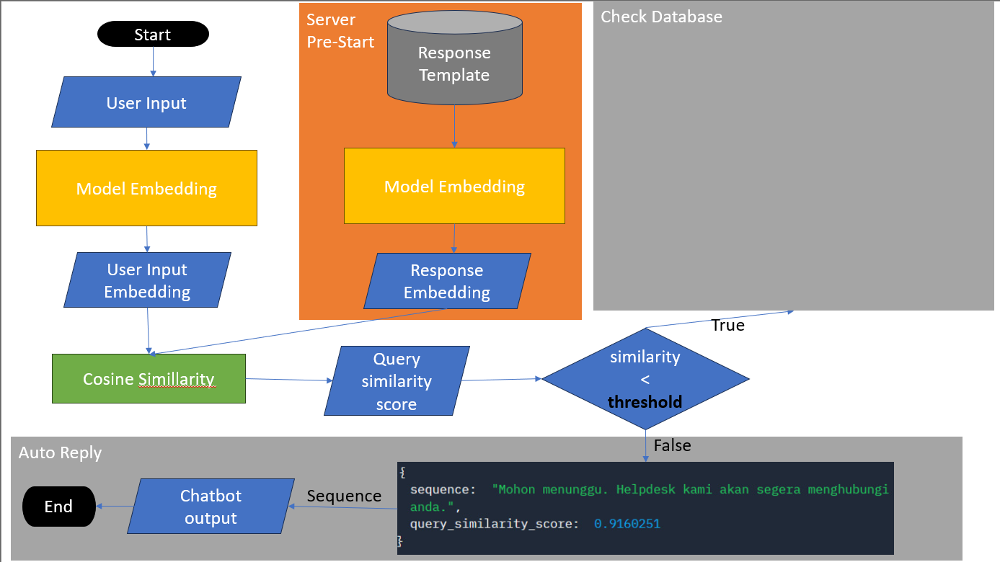
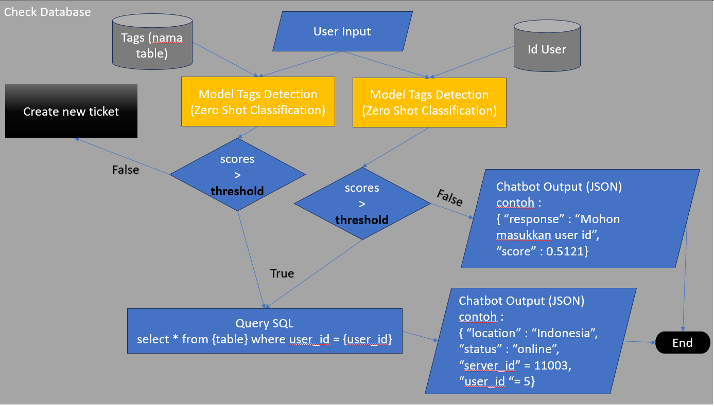
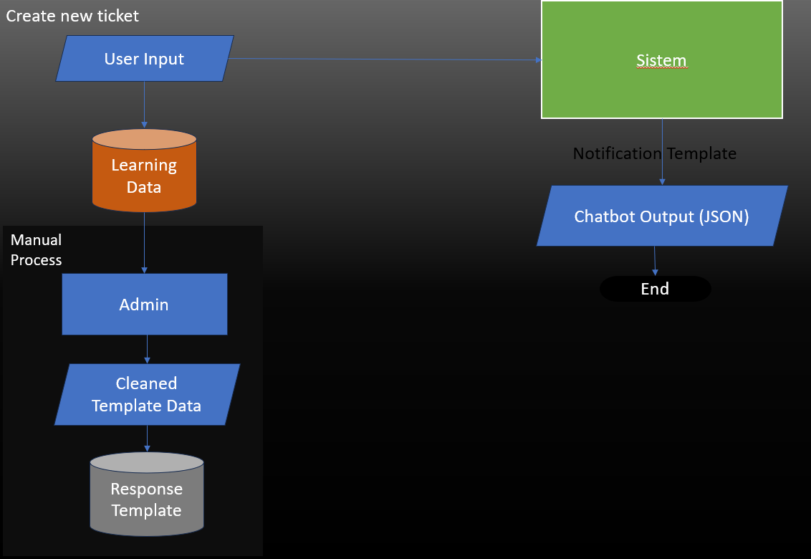

# Lintas Media Danawa (LMD) ChatBot
### Inputs
1. Query : user input / questions
2. Threshold : minimum score for model to retrieve the information from static knowledge base. Ranges from 0-1

### Outputs
Json format consists of the chatbot response and the similarity scores

## How it works
There are two models to build the chatbot : Zero-Shot Classfication and Instructor Embedding models<br>

Below are the flowcharts of the model's inference pipeline :

<br>
Flowchart of "check database" process of the above flowchart :

<br>
Flowchart of "create new ticket" process of the above flowchart : 


## Run App
Clone the github
```bash
git clone https://github.com/Jonathanjordan21/lmd_chatbot.git
```

Start the flask app
```bash
flask run
```

